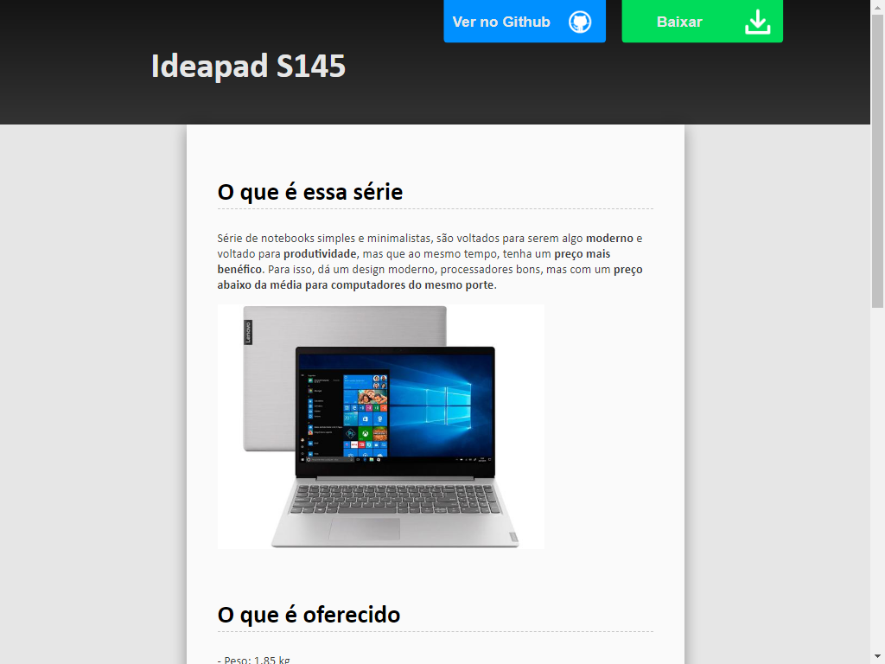
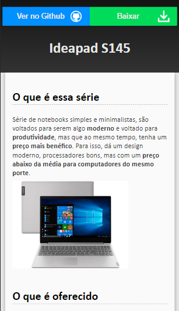

# spot.linguagens

## Imagens e icones de 
  https://www.pngegg.com/pt/png-kwoga/download

  https://icon-icons.com/pt/icones/busca/olho

  https://icons8.com

## Feito com:
  • HTML (puro)

  • CSS (puro)
  
  • Editor: Sublime Text 3 (https://www.sublimetext.com/)

## Sobre o que é o site

  Fala sobre a série Ideapad S145 da Lenovo. _**Não sou alguém que é pago pra isso**_,
  fiz sobre esse tema simplesmente porque enquanto procurava notebooks custo-benefício
  criei uma espécie de afeto por ele.
  
## De onde se inspirou essa interface
  
   A interface foi inspirada no tema **Slate** do próprio github pages _(Se você buscar outras
   versões dessa mesma página nas branches vai ver que foi o primeiro que usei)_.
   
   Por 2 motivos: 
   
   • 1 - é muito bonito, moderno e simples
   
   • 2 - é um bom desafio para um iniciante nessa parte front-end
  
## Sobre a página

  ### Elementos

  Os elementos usados são todos diretamente do HTML, ou seja, não programei nenhum elemento de
  modo externo _(como JavaScript, TypeScript, ou PHP)_ , apenas fiz uso dos elementos já apresentados no HTML.
  
  
  ### Organização
  
  A página tem um sistema organizacional muito simples, que se baseia nas sections.
  
  Se você for usar esse style.css, saiba que boa parte do que o site é está nas sections usadas,
  ou seja, eu coloquei a maior parte da organização do código nela.
  
  Além disso, a maior parte da organização executada eu tirei do próprio tema Slate.
  Já que foi de lá que peguei boa parte da inspitação.
  
  
  ### Por que o roteiro foi escrito todo pelo HTML
  
  Embora quisesse, não consegui fazer um código pra escrever dinâmicamente a página pela web.
  
  Isso aconteceu porque o servidor do gh-pages funciona por base somente em langs mais aceitas em navegadores, 
  e até agora não domino nenhuma desse tipo.
  
  É provável que em algum período eu disponibilize um script que escreva esse roteiro de modo mais dinâmico, pelo
  tempo disponível, optei por escrever manualmente.
  
  E como é a minha _"língua materna"_ é bem provável que será em python.
  
  
## Funcionamento
  
  
  
  
