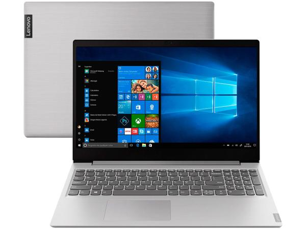

# Série Ideapad S145 da Lenovo
** **

## O que é essa série?

Série de notebooks simples e minimalistas, são voltados para serem algo **moderno** e voltado para **produtividade**, mas que ao mesmo tempo, tenha um **preço mais benéfico**.

Para isso, dá um design moderno, processadores 
bons, mas com um **preço abaixo da média para computadores do mesmo porte**.

## O que é oferecido

- Peso: 1,85 kg
- Tela: LED, 15,6 polegadas
- Resolução: 1366 x 768 pixels (HD) ou 1920 x 1080 pixels (Full HD)
- Processador: Intel Celeron N4000, Core i5 8265U ou Core i7 8565U
- Sistema Operacional: Windows 10 Home ou Windows 10 Pro
- Memória RAM: 4, 8 ou 12 GB DDR4
- Armazenamento: HD de 500 GB, HD de 1 TB ou SSD de 256 GB
- Vídeo: Intel UHD Graphics ou Nvidia GeForce MX110
- Interfaces: 2 x USB 3.1, 1 x USB 2.0, 1 x HDMI, entrada para fone de ouvido, leitor de cartões 4 em 1, Wi-Fi e Bluetooth
- Cor: prata
- Dimensões: 36,2 x 25,1 x 1,99 cm

## O spot produzido

O spot produzido se baseia em apresentar como um produto de rádio, ou como um comercial completamente baseado em áudio.

<audio src="Arquivos/final1.mp3" controls preload="auto"> Meu áudio </audio>
 
 
## Roteiros
 
 Tudo que pensei como roteiro, o link do que usei como base e todas as ideias iniciais e aspectos que utilizei para me referir
 
<a href="Arquivos/Roteiro.txt"><button style="width: 100%; border: 3px solid black; border-radius: 10px; padding: 15px; cursor: pointer; font-size: 3rem;"> Roteiro </button></a>
 

